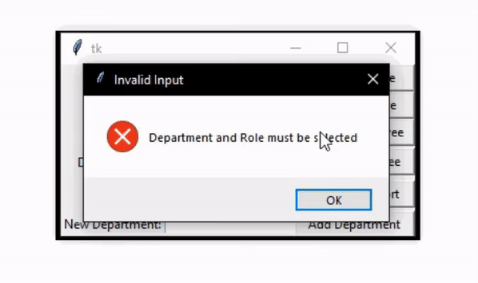
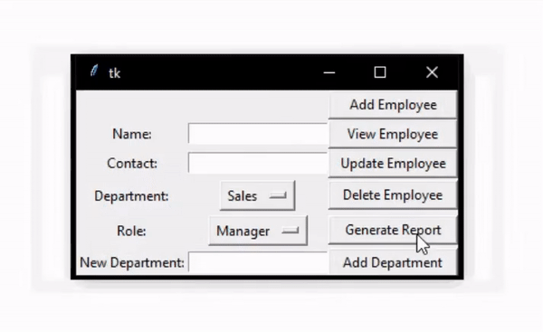
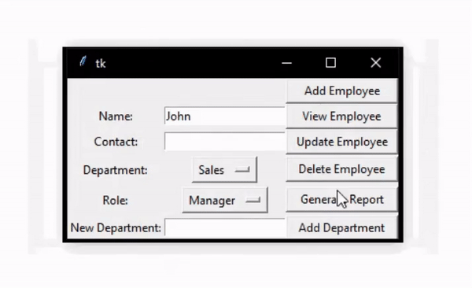
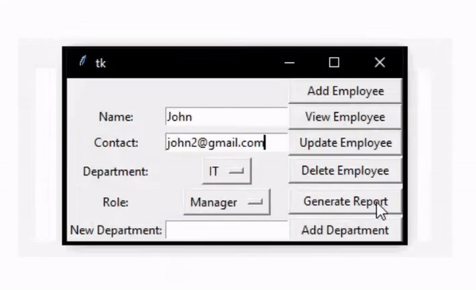
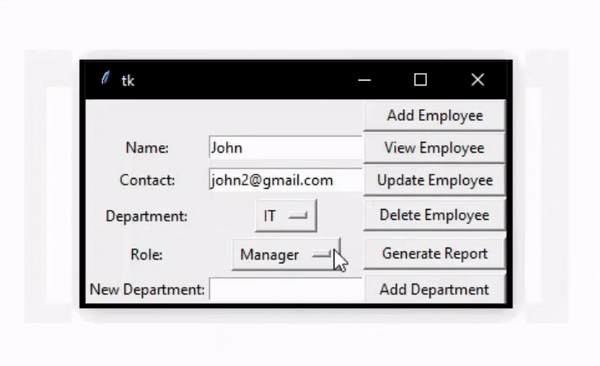

# Employee Management System

This project is an employee management system implemented using Python and SQLite. The application provides a GUI interface for users to interact with the database.

## Getting Started

Clone the repository to your local machine and navigate to the project directory.

```bash
git clone https://github.com/b-gandurov/employee_management_system.git
```

Run the main python script from the command line:

```bash
python main.py
```

A new window will pop up. You can then interact with the database using the GUI.

## Features

The setup has the following features:

- Add an employee: User can add new employees with details like name, contact information, department and role.

- View an employee: User can view the details of an employee by entering the employee's name.

- Update an employee: User can update the details of an existing employee.

- Delete an employee: User can delete an employee from the system.

- Generate a report: User can generate a report listing all employees.
- Add a department: User can add a new department.


## Built With

- Python
- Tkinter: Used for GUI
- SQLite: Used for backend database

